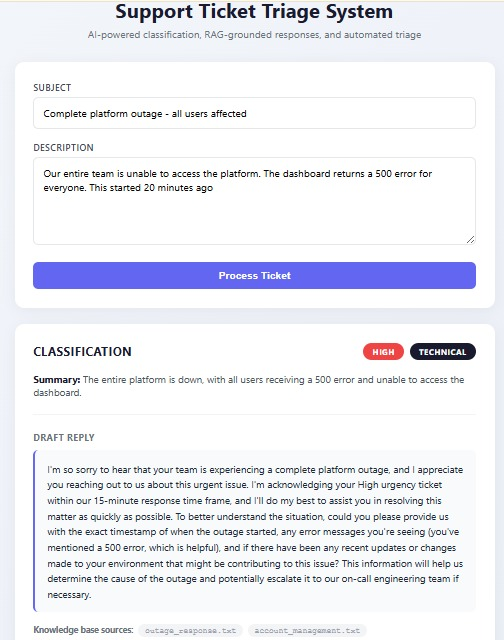

# 🎯 AI-Powered Support Ticket Triage System

An end-to-end automation pipeline that classifies incoming customer support tickets, retrieves relevant company policy context using RAG, and drafts AI-generated responses — all wrapped in a Flask web interface.

Built to demonstrate practical applications of **prompt engineering**, **AI automation**, **Retrieval-Augmented Generation (RAG)**, and **full-stack Python development**.



---

## 🚀 What It Does

1. A support ticket (subject + description) is submitted via a web form.
2. **Classification (Prompt Engineering)** — an LLM classifies the ticket into a category (`Technical`, `Billing`, `Feature Request`, `Account`, `Other`) and urgency level (`Low`, `Medium`, `High`), returning structured JSON.
3. **Retrieval (RAG)** — the ticket text is embedded and used to search a vector database of company policy documents (encryption policy, billing policy, outage response protocol, integration support, account management).
4. **Response Generation (Prompt Engineering + RAG)** — the retrieved policy context is injected into a second prompt, which generates a professional draft reply grounded in actual company procedures (response timeframes, escalation paths, etc.).
5. **Automation** — the entire classify → retrieve → generate pipeline runs without manual intervention, either in batch (via `pipeline.py`) or per-ticket (via the Flask UI).

---

## 🏗️ Architecture

```
User submits ticket (Flask form)
        ↓
Classification Prompt → LLM (Llama 3.3 70B via Groq)
        ↓
   {category, urgency, summary} (JSON)
        ↓
RAG Retrieval → ChromaDB vector search over knowledge base
        ↓
   Relevant policy chunks
        ↓
Response Generation Prompt (ticket + classification + retrieved context) → LLM
        ↓
   Draft reply + sources used
        ↓
Displayed in Flask UI
```

---

## 🛠️ Tech Stack

| Component | Technology |
|---|---|
| Language | Python 3.11 |
| LLM Provider | Groq API (Llama 3.3 70B) |
| Web Framework | Flask |
| Vector Database | ChromaDB |
| Embeddings | ChromaDB default embedding function (lightweight, ONNX-based) |
| Data | [Tobi-Bueck/customer-support-tickets](https://huggingface.co/datasets/Tobi-Bueck/customer-support-tickets) (Hugging Face) |

---

## 📂 Project Structure

```
support-triage-project/
├── data/
│   └── knowledge_base/          # Company policy documents for RAG
│       ├── encryption_policy.txt
│       ├── billing_policy.txt
│       ├── outage_response.txt
│       ├── integration_support.txt
│       └── account_management.txt
├── prompts/
│   ├── classification_prompt.py # Classification system prompt
│   └── response_prompt.py       # Response generation system prompt
├── templates/
│   └── index.html               # Flask UI
├── app.py                        # Flask web application
├── pipeline.py                   # Batch processing pipeline (CLI)
├── rag.py                         # RAG: embedding, retrieval, knowledge base
├── download_data.py              # Downloads & samples ticket dataset
├── requirements.txt
├── .env.example
└── README.md
```

---

## ⚙️ Setup & Installation

### 1. Clone the repository

```bash
git clone https://github.com/yourusername/support-triage-project.git
cd support-triage-project
```

### 2. Create and activate a virtual environment

```bash
python -m venv venv

# Windows
venv\Scripts\activate

# Mac/Linux
source venv/bin/activate
```

### 3. Install dependencies

```bash
pip install -r requirements.txt
```

### 4. Set up your API key

Get a free API key from [console.groq.com](https://console.groq.com), then:

```bash
cp .env.example .env
```

Edit `.env` and add your key:

```
GROQ_API_KEY=your_groq_api_key_here
```

### 5. Build the knowledge base (RAG)

```bash
python rag.py
```

This embeds the policy documents in `data/knowledge_base/` into a local ChromaDB vector store.

### 6. Run the app

**Web interface:**
```bash
python app.py
```
Then open `http://127.0.0.1:5000` in your browser.

**Batch pipeline (CLI):**
```bash
python download_data.py   # downloads sample tickets to tickets.csv
python pipeline.py        # processes all tickets, outputs results.json
```

---

## 🧪 Example

**Input:**
- Subject: *Complete platform outage - all users affected*
- Description: *Our entire team is unable to access the platform. The dashboard returns a 500 error for everyone. This started 20 minutes ago.*

**Output:**
- **Category:** Technical | **Urgency:** High
- **Summary:** The entire platform is down, with all users receiving a 500 error and unable to access the dashboard.
- **Retrieved sources:** `outage_response.txt`, `account_management.txt`
- **Draft Reply:** *"I'm so sorry to hear that your team is experiencing a complete platform outage... I'm acknowledging your High urgency ticket within our 15-minute response time frame..."*

The 15-minute response commitment is pulled directly from the `outage_response.txt` policy document via RAG — the model isn't inventing this, it's grounded in the provided context.

---

## 🧠 Prompt Engineering Highlights

- **Structured JSON output**: the classification prompt enforces a strict JSON schema (`category`, `urgency`, `summary`), enabling reliable downstream automation without manual parsing.
- **Few-shot examples**: the classification prompt includes an example output to anchor the model's response format.
- **Context injection**: retrieved RAG documents are inserted into the response prompt with explicit instructions to incorporate relevant policy details (timelines, escalation paths) naturally into the reply.
- **Edge case handling**: tested against vague tickets ("Help — it's not working"), multi-issue tickets, and non-English tickets — the model appropriately asks clarifying questions rather than hallucinating details. See `PROMPT_ENGINEERING.md` for the full evaluation.

---

## 📊 Dataset Note

This project uses a sample of 50 tickets from the [Tobi-Bueck/customer-support-tickets](https://huggingface.co/datasets/Tobi-Bueck/customer-support-tickets) dataset (61.8k total rows, filtered to English) to demonstrate and validate the pipeline's classification accuracy, RAG retrieval, and automated response generation. The knowledge base documents (`data/knowledge_base/`) were authored specifically for this project to match common ticket themes found in the dataset (security/encryption, billing, integrations, outages, account access).

---

## 🔮 Future Improvements

- [ ] SQLite-based ticket history and dashboard view
- [ ] Prompt evaluation framework comparing multiple prompt versions
- [ ] Multi-language response consistency (currently the model may respond in the ticket's language)
- [ ] Deploy live demo (Render/Hugging Face Spaces)

---

## 📄 License

This project is for educational/portfolio purposes.
```

A few notes:

1. Replace `yourusername` in the clone URL with your actual GitHub username once you create the repo.
2. Create a `screenshots/` folder in your project root and save your two best screenshots there (e.g., `ui-screenshot-1.png`).
3. I referenced `PROMPT_ENGINEERING.md` in the prompt engineering section — let me know if you want me to draft that next, or if you'd rather skip it and just remove that line.

Want me to draft `PROMPT_ENGINEERING.md` next, or move to GitHub push instructions?